# makers-beehive

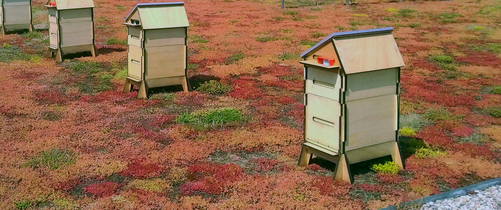

## Material

- 10 plywood boards (1000x600x10mm)
- 1 PMMA sheet
- 1 [Smart Citizen Kit](https://www.seeedstudio.com/smartcitizen)
- 1 [20W solar panel](https://www.eco-worthy.com/catalog/worthy-polycrystalline-solar-panel-module-charging-boat-p-455.html)
- 1 [Raspberry Pi 3](https://www.adafruit.com/product/3055) + [PiCam](https://www.adafruit.com/product/3099)
- 1 [30000mAh battery pack](http://www.tecknet.co.uk/bluetek.html)
- 1 40 Ohms 10W resistor
- 4 [load sensors](https://www.ebay.fr/itm/4pcs-DIY-50KG-Body-Load-Cell-Weight-Strain-Sensor-Resistance-With-HX711-AD-Modul-/273551564004?hash=item3fb0f19ce4)
- 1 [12V/5V DC Converter](https://www.ebay.fr/itm/Adafruit-UBEC-DC-DC-Step-Down-Buck-Converter-5V-3A-output-ADA1385-/232460927653?hash=item361fc042a5)

## Machines

- 1 laser cut
- 1 3d printer
- 1 soldering iron

## Step 1 - fab the parts

You need to cut in 10mm plywood boards [theses parts](lasercut-parts/makers-dadant-parsing.ai) with a laser cutter. We use a Trotec Speedy 400 at makers lab.  
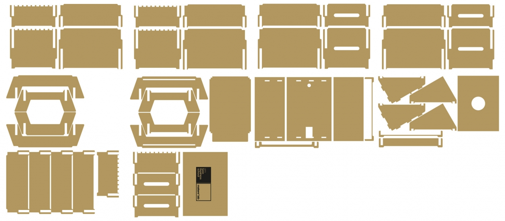

*laser cut settings we use : P100 V0,25 Hz2000*  
**It will take you about 3 hours of cutting :**  
plate 1 : 00:14:09  
plate 2 : 00:16:30  
plate 3 : 00:14:47  
plate 4 : 00:14:47  
plate 5 : 00:15:44  
plate 6 : 00:15:44  
plate 7 : 00:13:35  
plate 8 : 00:12:25  
plate 9 : 00:17:05  
plate 10 : 00:16:30  

## Step 2 - Assemble the body of the hive

**Assemble the footer**:  
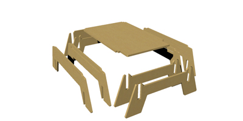
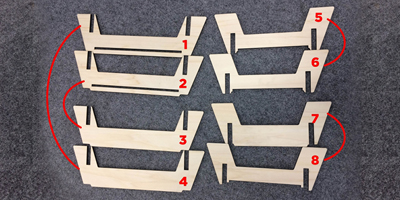
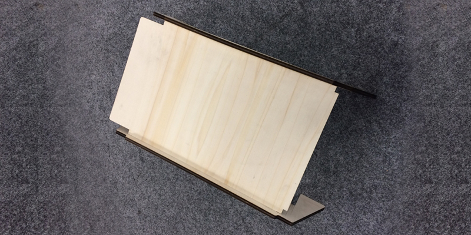
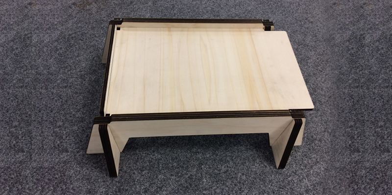

**Assemble the chamber**:  
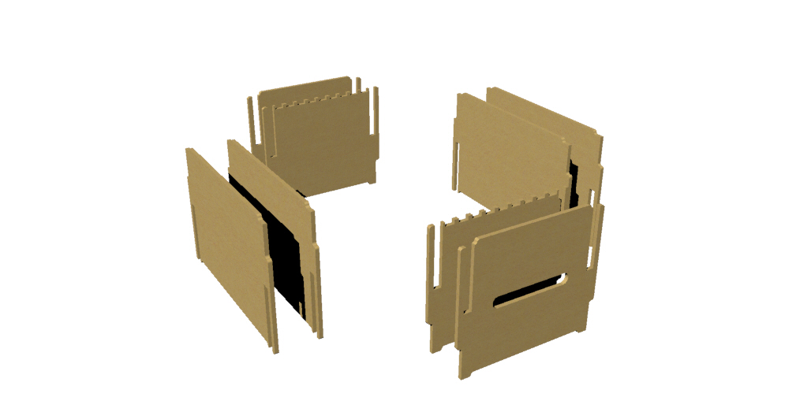
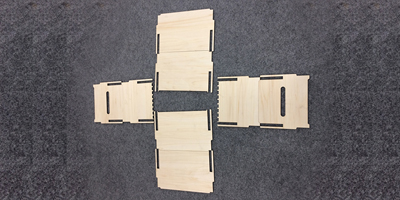

**Assemble the storeyed case**:  

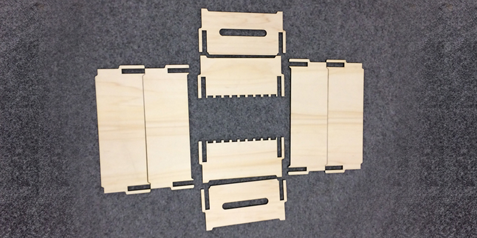
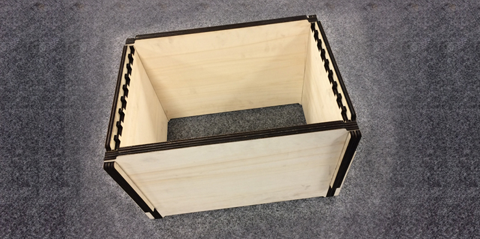

**Assemble the roof top**:  
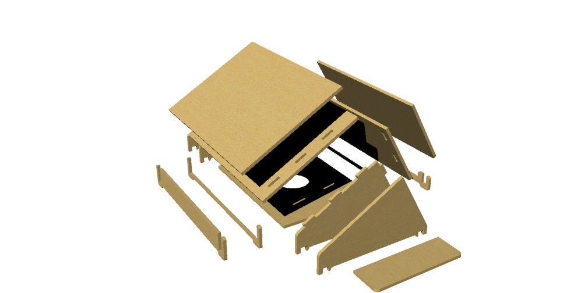
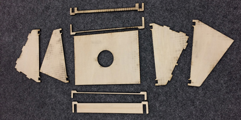
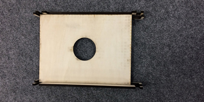
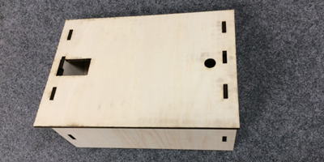
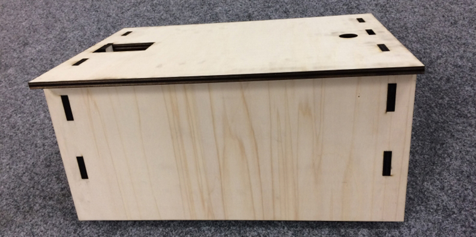

## Step 3 - Assemble electronics parts

**assemble electronics case**:  
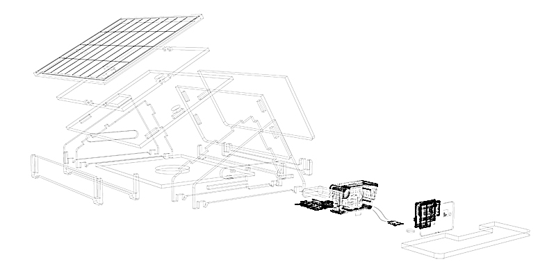

**push code into Pi + SCK**:  
You can find on [emlyon/makers-beehives-hardware](https://github.com/emlyon/makers-beehives-hardware) all the code for electronics.

## Step 4 - Dashboard
See on [emlyon/makers-beehives-website](https://github.com/emlyon/makers-beehives-website) how we made our dashboard.
