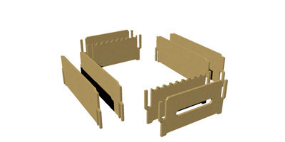

# makers-beehive

## Material

- 10 plywood boards (1000x600x10mm)
- 1 PMMA sheet
- 1 Smart Citizen Kit
- 1 [20W solar panel](https://www.ebay.fr/itm/ECO-WORTHY-20W-12V-Module-de-Panneau-Solaire-Polycristallin-pour-Batter-25W/113069851898?hash=item1a537d04fa:g:PHEAAOSwbbdbJXt9)
- 1 Raspberry Pi + PiCam
- 1 30000mAh battery pack
- 1 40Ohms 10W resistor

## Machines

- 1 laser cut
- 1 3d printer
- 1 soldering iron

## Step 1 - fab the parts

You need to cut in 10mm plywood boards [theses parts](lasercut-parts/makers-dadant-parsing.ai) with a laser cutter. We use a Trotec Speedy 400 at makers lab.

*laser cut settings we use : P100 V0,25 Hz2000*
**It will take you about 3 hours of cutting :**
plate 1 : 00:14:09
plate 2 : 00:16:30
plate 3 : 00:14:47
plate 4 : 00:14:47
plate 5 : 00:15:44
plate 6 : 00:15:44
plate 7 : 00:13:35
plate 8 : 00:12:25
plate 9 : 00:17:05
plate 10 : 00:16:30

## Step 2 - Assemble the body of the hive

**Assemble the footer**:

**Assemble the chamber**:

**Assemble the storeyed case**:

**Assemble the roof top**:

## Step 3 - Assemble electronics parts

**electronics case**:
WIP

**Smart Citizen Kit**:
WIP

**Raspberry Pi + cam**:
WIP
